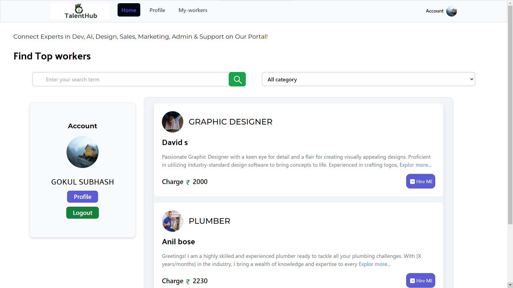
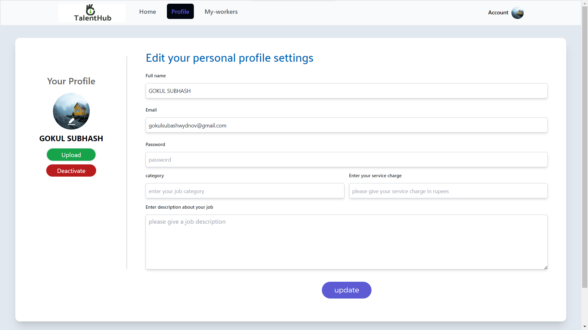
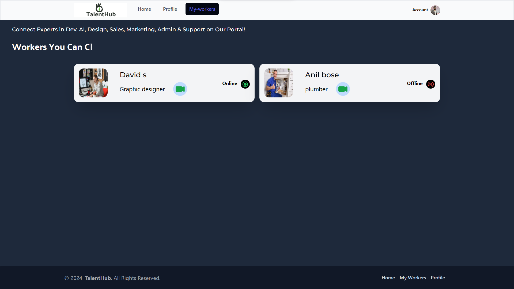
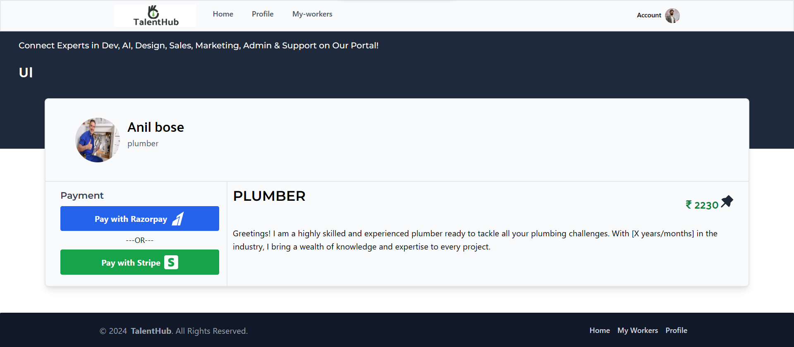
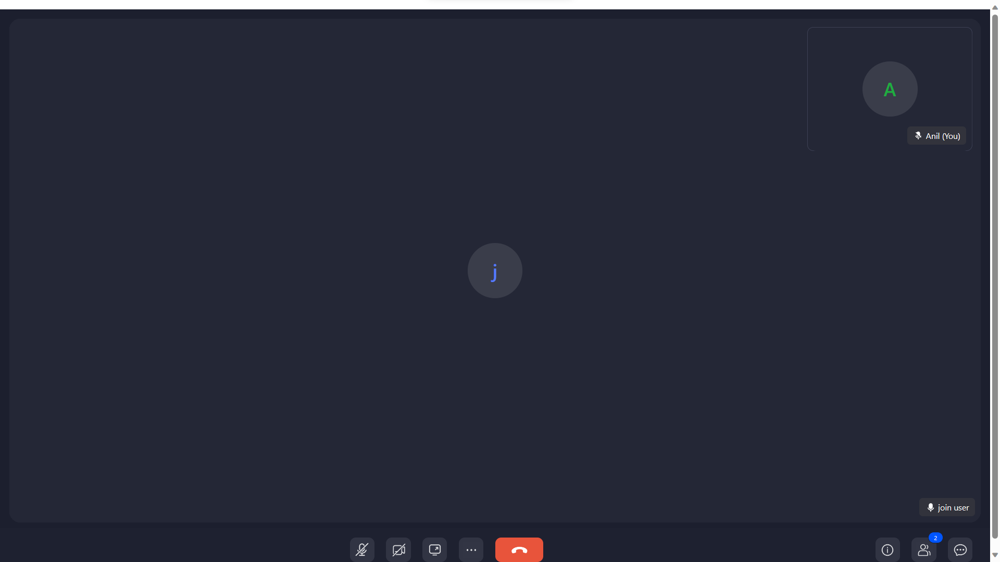

# TalentHub - Your Gateway to Seamless Hiring!

TalentHub, a cutting-edge MERN web application, empowers you to effortlessly hire skilled workers for your tasks. What sets us apart is our commitment to user-friendly features, allowing you to connect with workers seamlessly through video calls.

## Features

- **Hire Workers:** Browse and hire skilled professionals with ease.
- **Easy Payments:** Effortless transactions through Stripe and Razorpay.
- **Search and Filter:** Find the perfect match using our advanced search and filter options.
- **Profile Updates:** Keep your information current and showcase your skills.
- **Video Call Interaction:** Connect with hired workers via video calls after payment.

## Screenshots

### 1. Homepage with Search and Filter



- The homepage provides options for searching and filtering workers.

### 2. Account and Account Settings Management



- Access your account and manage settings with ease.

### 3. Online Workers



- View a list of online workers available for calls.

### 4. Single Worker Profile with Payment Options



- Explore a single worker's profile and choose payment options via Stripe and Razorpay.

### 5. Video Call Facility



- Enjoy the video call facility to connect with hired workers seamlessly.

  

## Getting Started

Get started in no time with these simple steps:

### Prerequisites

- Node.js
- npm

### Installation

1. Clone the repository to your local machine:

    ```bash
   git clone https://github.com/thisisgokul/TalentHub.git
    ```

2. Navigate to the client directory, install dependencies, and start the client:

    ```bash
    cd client
    npm install
    npm start
    ```

3. In another terminal window, navigate to the server directory, install dependencies, and start the server:

    ```bash
    cd server
    npm install
    npm start
    ```

Now, experience the application running in development mode!

## Contributing

Excited to contribute? Check out our [Contributor's Guide](CONTRIBUTING.md) to get started. We welcome your pull requests and ideas!

Feel free to customize and enhance this platform based on your unique needs! Happy hiring!
